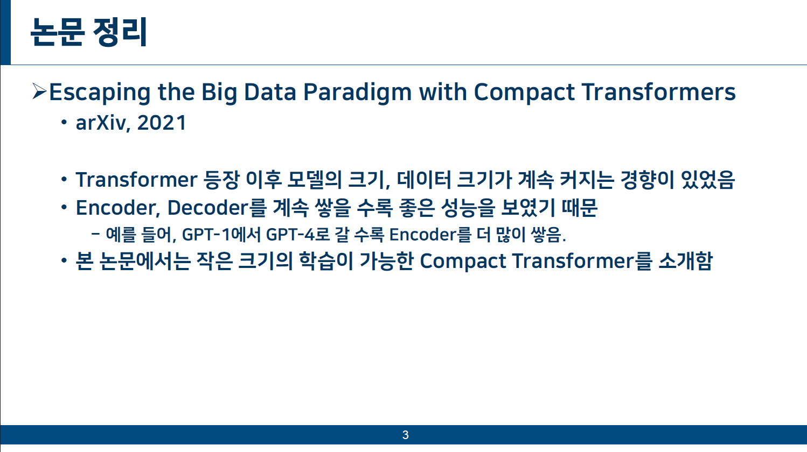

# Project Title

- This project is for implementing [CCT (Compact Convolutional Transformers)](https://arxiv.org/pdf/2104.05704).

- [Paper] Escaping the Big Data Paradigm with Compact Transformers (arXiv, 2021)

# Documentation

- Detailed implementation steps and training results can be found [here](docs/example.pdf).

# Reference
- https://github.com/hyunwoongko/transformer/tree/master
- Using config files
- Basics of Machine Learning with PyTorch: https://wikidocs.net/book/9379
